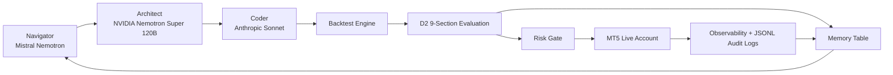

# ☘ Project Trifolium ☘

> **🌐 [Live Demo](https://brishian427.github.io/Triofolium/) 🌐**
>
> A self-improving algorithmic trading system with institutional risk governance.

Project Trifolium is a self-improving algorithmic trading system built for the MOMQ Finals Tech Prize. It combines a multi-LLM strategy discovery loop, an institutional Risk Gate, MT5 live execution, D2 evaluation reports, and a deployed profit harvester that produced auditable live trading evidence during the competition.

## ☘ Architecture

Full architecture notes: [docs/architecture.md](docs/architecture.md)



## ☘ Results Summary

- Explored 8 strategy candidates through the self-improving loop.
- Implemented the D2 9-section evaluation framework: Identity, Gate Check, Primary Objective, Secondary Metrics, Binding Check, Robustness, Regime Consistency, Failure Modes, Decision.
- Deployed a profit harvester with approximately +$495 realized automated profit across the live session evidence.
- Logged 12,619 Risk Gate decisions in the exported demo package.
- Implemented 7 hard-kill layers during live deployment: margin floor, single-instrument loss, total unrealized loss, drawdown, per-trade volume cap, session-total loss floor, and anomaly trade-count detection.
- Discovered a live constitutional refinement: rate-limit policy must be direction-aware so safety checks do not block legitimate closing/reducing orders.
- Produced a full audit export separating automated activity from manual/client-side activity by MT5 `magic` and `comment`.

## ☘ Project Writeup

Long-form technical writeup: [docs/writeup.md](docs/writeup.md)

Short submission description: [docs/submission_description.txt](docs/submission_description.txt)

## System Components

- `src/trifolium/agents/`: self-improving loop brain/coder/guardrail components.
- `src/trifolium/validation/l5.py`: reusable D2 validation callable and report generation.
- `src/trifolium/risk_gate/`: institutional order gateway, risk checks, logging, and observability.
- `src/trifolium/strategy/v0/`: Strategy v0 implementation and live strategy interface.
- `scripts/live_profit_harvester.py`: live fixed-direction profit harvester.
- `scripts/export_demo_data.py`: read-only export of MT5 history and local JSONL logs for demo evidence.
- `scripts/demo_ui.py`: local demo UI entry point.

## Tech Stack

- Python
- MetaTrader 5 Python API
- NVIDIA NIM: Mistral Nemotron and Nemotron Super 120B
- Anthropic Sonnet
- Pydantic / pydantic-settings
- PyYAML
- SQLite-style memory table architecture
- Streamlit-style demo workflow
- JSONL audit logs

## ☘ Demo Evidence

The demo export is under:

```text
reports/demo_data_20260626_210907/
```

Important files:

- `DEMO_INDEX.md`: Chinese demo guide explaining which file proves what.
- `mt5_history_deals.csv`: exported MT5 deal history.
- `mt5_history_orders.csv`: exported MT5 order history.
- `mt5_open_positions.csv`: open positions at export time.
- `risk_gate_decisions.csv`: every logged Risk Gate decision.
- `profit_harvester_key_events.csv`: harvester entry/take-profit/rejection lifecycle events.
- `account_state_timeseries.csv`: account observability stream.
- `realized_pnl_by_magic_comment.csv`: PnL attribution by MT5 `magic` and `comment`.
- `raw_logs.zip`: compressed raw evidence logs.

Latest export snapshot:

- MT5 deals exported: 334
- MT5 orders exported: 325
- Risk Gate decisions parsed: 12,619
- Profit harvester key events parsed: 14,860
- Profit harvester realized attribution: +$494.98

## Competition Context

- Competition: MOMQ Finals
- Account: 10181
- Broker/server shown by MT5: FTWorldwide-MainTrade
- Original system objective: build a live self-improving trading institution rather than a single hand-written strategy.

## Quick Start

```powershell
python -m venv .venv
.\.venv\Scripts\python.exe -m pip install -r requirements.txt
```

Create `.env` locally. Do not commit it.

```text
MT5_LOGIN=
MT5_PASSWORD=
MT5_SERVER=
```

## Smoke Test

```powershell
.\.venv\Scripts\python.exe scripts\smoke_test_mt5.py
```

The smoke test loads credentials from `.env`, initializes MT5, prints sanitized terminal/account information, checks market data, and verifies the configured competition instruments.

## Run D2 Validation

```powershell
.\.venv\Scripts\python.exe scripts\validate_strategy.py
```

## Export Demo Data

This is read-only. It does not submit orders, close positions, restart runners, or modify live trading state.

```powershell
.\.venv\Scripts\python.exe scripts\export_demo_data.py --start 2026-06-22T00:00:00+00:00
```

## Live Trading Safety Boundary

All automated orders are intended to pass through `risk_gate.submit_order` before touching MT5. The project includes static isolation tests to prevent direct `mt5.order_send` bypasses outside the Risk Gate execution layer.

## Notes

The project intentionally preserves audit artifacts and incident reports because the Tech Prize submission is not only about final PnL. It demonstrates an evolving trading institution: strategy generation, evaluation, deployment, observability, risk governance, and post-incident learning.
