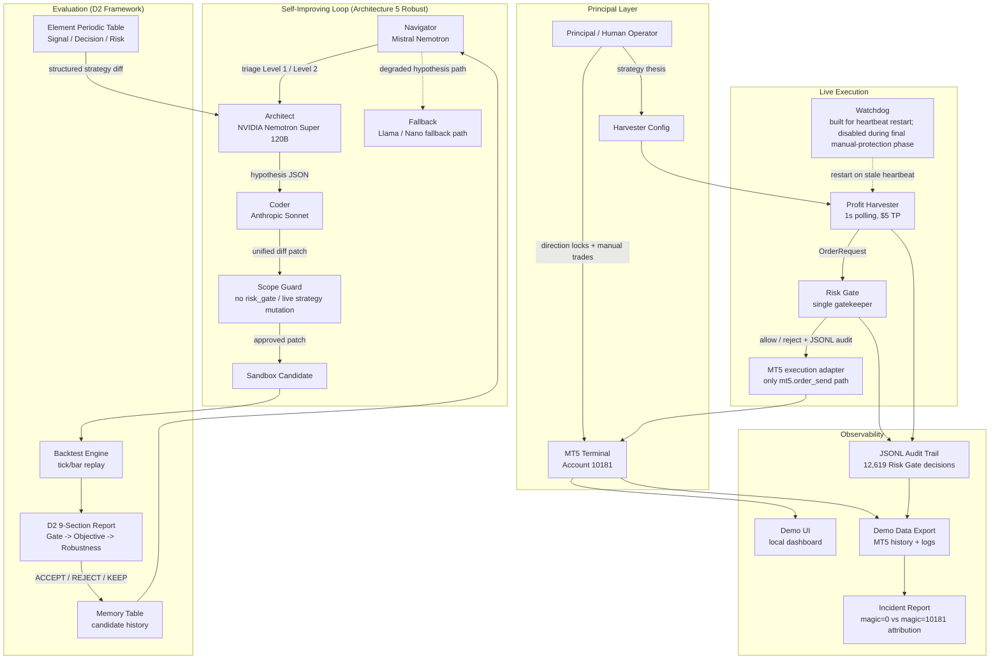

# Project Trifolium Architecture

This diagram reflects what was actually built during the MOMQ Finals Tech Prize effort: a self-improving research loop, a D2 evaluation layer, a Risk Gate protected MT5 execution path, and a live profit harvester with JSONL audit evidence.

## Invariants

- Automated orders are intended to pass through `risk_gate.submit_order`.
- Direct MT5 execution is isolated to the Risk Gate execution adapter.
- Self-improving loop candidates are generated in sandboxes and guarded against mutating live Risk Gate files.
- MT5 `magic` and `comment` fields are used to distinguish automated harvester actions from manual/client-side actions.
- The demo data export is read-only and does not submit, close, or modify live positions.
